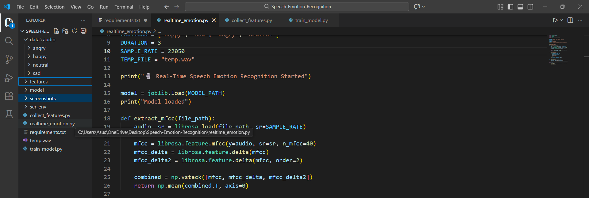
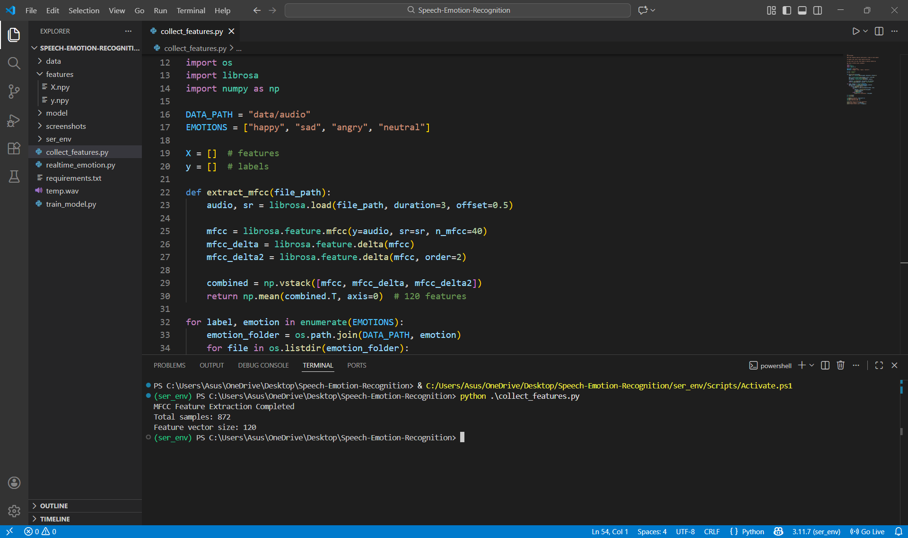
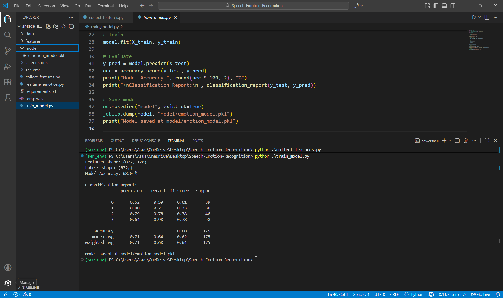
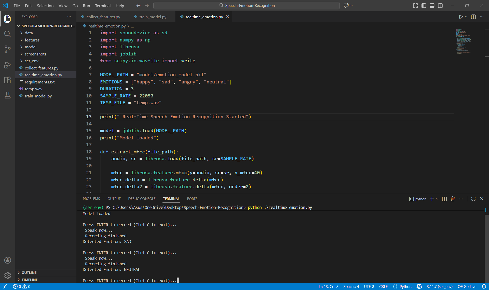

## Speech Emotion Recognition Project

This project implements a Speech Emotion Recognition system using machine learning techniques. The system analyzes human speech and predicts emotions such as happy, sad, angry, and neutral. It also supports real-time emotion detection using microphone input.

# Project Objective

The objective of this project is to build a machine learning based system that can recognize human emotions from speech signals using audio feature extraction and classification techniques.

# Technologies Used

Python  
Librosa  
NumPy  
Scikit-learn  
SoundDevice  
Joblib  

# Dataset Used

The project uses the RAVDESS (Ryerson Audio Visual Database of Emotional Speech and Song) dataset for training and evaluation.

RAVDESS is a publicly available and widely used benchmark dataset for speech emotion recognition research. It contains high-quality studio-recorded speech samples spoken by professional actors with clearly labeled emotional states.

Only speech audio files in WAV format were used in this project. The dataset was manually organized into emotion-based folders for supervised learning.

Emotions considered in this project are:
Happy  
Sad  
Angry  
Neutral  

The Calm emotion samples were merged with the Neutral class to simplify the classification task. Other emotions such as Fearful, Disgust, and Surprised were excluded in the initial implementation to improve model stability and accuracy.

Dataset Source

Official RAVDESS dataset:
https://zenodo.org/record/1188976

Alternative Kaggle mirror:
https://www.kaggle.com/datasets/uwrfkaggler/ravdess-emotional-speech-audio

# Project Structure

Speech-Emotion-Recognition  
# data/audio  
  happy  
  sad  
  angry  
  neutral  
# features  
  X.npy  
  y.npy  
# model  
  emotion_model.pkl  
# screenshots  
  dataset_structure.png  
  mfcc_extraction.png  
  model_training.png  
  realtime_prediction.png  
# Executable codes 
collect_features.py  
train_model.py  
realtime_emotion.py  
requirements.txt  
README.md  

# How the System Works

Audio input is collected either from stored WAV files or directly from the microphone.  
MFCC, delta, and delta-delta features are extracted from the audio signal.  
The extracted features are passed to a trained machine learning model.  
The model predicts the corresponding emotion label.  
The predicted emotion is displayed in the terminal in real time.

# Model Details

The system uses a RandomForest classifier for emotion classification.  
MFCC features along with delta and delta-delta coefficients are used.  
Feature normalization and class balancing are applied during training.  

Results

The model achieves approximately 65 to 70 percent accuracy during real-time emotion detection. This performance is considered realistic due to differences between studio-recorded training data and live microphone input.

# Screenshots

# How to Run the Project

Create and activate a Python virtual environment.  
Install required libraries using requirements.txt.  
Run collect_features.py to extract MFCC features.  
Run train_model.py to train the emotion classification model.  
Run realtime_emotion.py to perform real-time speech emotion detection.

# Future Improvements

Add more emotion classes.  
Use deep learning models such as CNN or LSTM.  
Improve noise robustness.  
Develop a graphical user interface.

Author

Aditya Singh Bhadauria

Usage Note

This project is developed strictly for academic and educational purposes.
